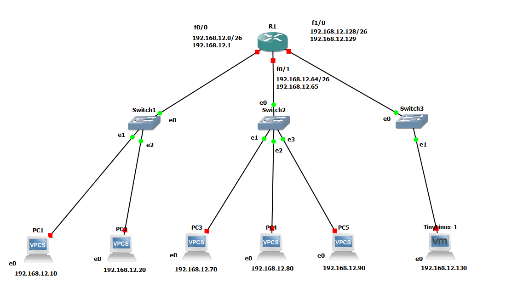
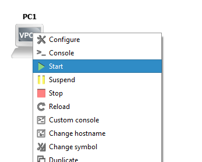
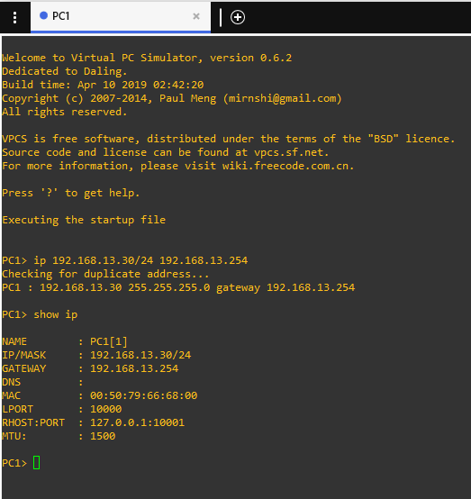
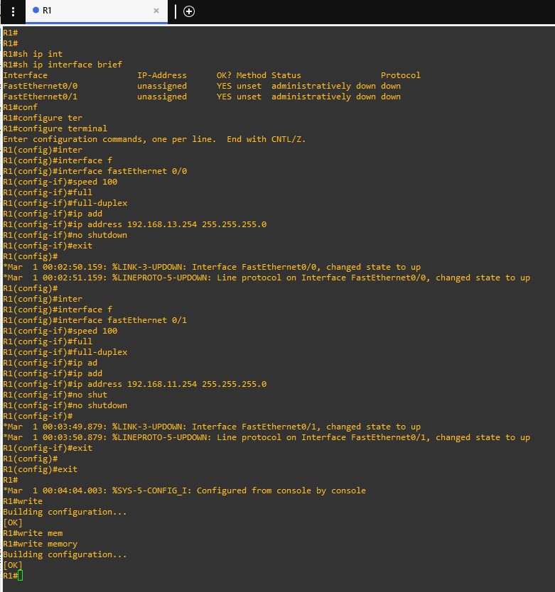
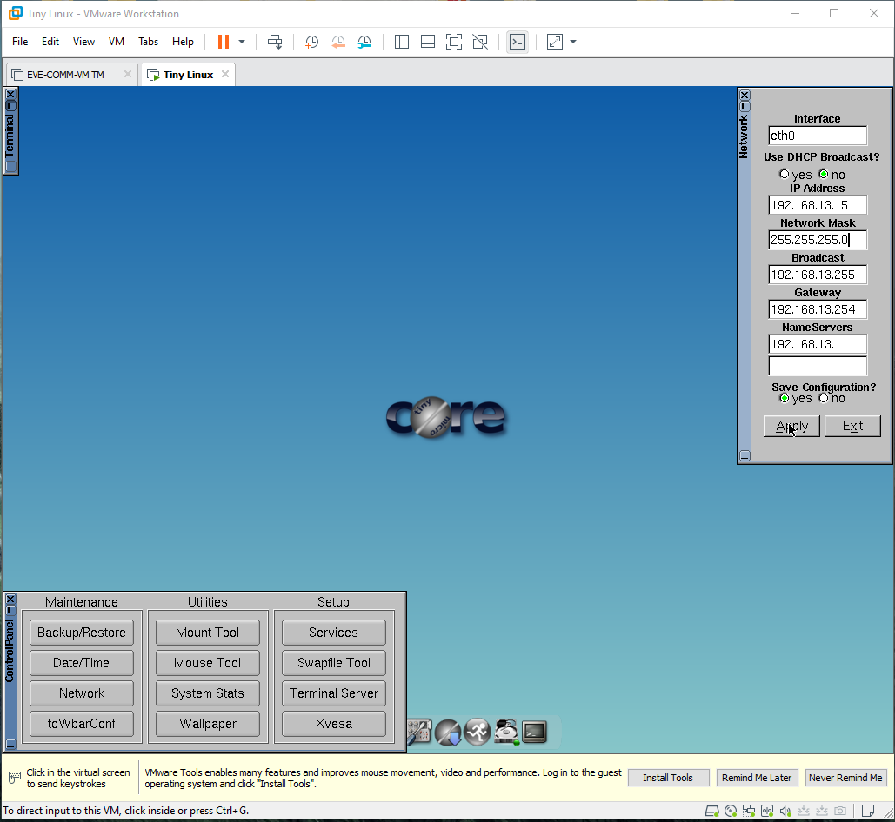

# Manual de Configuración

Se configuró y administró los dispositivos de una nueva infraestructura de red.
La empresa tiene operando 6 máquinas las cuales están distribuidas de la siguiente
manera:
| Departamento|Cantidad de Host|
|-------------|----------------|
|Finanzas     |2               |
|Ventas       |3               |
|Informática  |1               |

## Topología de Red

>Imagen 1: Topología de Red

Se optó a realizar el diseño de esta topología según lo solicitado en la tabla anterior, usando 3 switches por departamento. 

Los hosts y sus direcciones IP son las siguientes:
| VIRTUALIZADA|HOST       |CONECTADO A|DIRECCIÓN IP |GATEWAY       |
|-------------|-----------|-----------|-------------|--------------|
|No           |PC1        |Switch1    |192.168.12.10|192.168.12.129|
|No           |PC2        |Switch1    |192.168.12.20|192.168.12.129|
|No           |PC3        |Switch2    |192.168.12.70|192.168.12.129|
|No           |PC4        |Switch2    |192.168.12.80|192.168.12.129|
|No           |PC5        |Switch2    |192.168.12.90|192.168.12.129|
|Sí		      |TinyLinux-1|Switch3    |192.168.12.130|192.168.12.129|
>Tabla 1: Hosts y Direcciones IP

Las interfaces del router poseen las siguientes IPs:
| INTERFAZ		 |DIRECCIÓN DE RED  |DIRECCIÓN IP  |
|----------------|------------------|--------------|
|fastEthernet 0/0|192.168.12.0/26   |192.168.12.1  |
|fastEthernet 0/1|192.168.12.64/26  |192.168.12.65 |
|fastEthernet 1/1|192.168.12.128/26 |192.168.12.129|
>Tabla 2: Hosts y Direcciones IP

## Configurar VPCS
Para configurar las VPCS primero se debe iniciar la máquina que se desea y luego acceder a **>_ Console** tal y como se muestra en la siguiente imagen:

>Imagen 2: Iniciar VPCS

Estando ya en la consola de la VPCS a configurar se debe ingresar los siguientes comandos tomando en cuenta los valores de la **Tabla 1**:
>1. ip 192.168.13.30/24 192.168.13.254 -------------//comando para asignar la dirección IP, máscara y gateway 

>2. show ip -------------------------------------------//comando para mostrar las direcciones de la VPCS

>3. save -----------------------------------------------//comando para guardar las modificaciones hechas a la VPCS

>Imagen 3: Configuración de VPCS

Repetir con las VPCS restantes.

## Configurar Router
Para configurar el Router primero se debe iniciar y correr la consola tal y como se hace con las VPCS. Estando ya en la consola del Router se debe ingresar los siguientes comando tomando en cuenta los valores de la **Tabla 2**:

>1. sh ip interface brief

>2. configure terminal

>3. interface fastEthernet 0/0

>4. speed 100

>5. full-duplex

>6. ip address 192.168.13.254 255.255.255.0

>7. no shutdown

> 8. exit

Repetir otra vez del paso **2** al **8** para fastEthernet 0/1 y fastEthernet 1/0 y continuar con estos pasos:

>9. exit

>10. write

>11. write memory

>Imagen 4: Configuración del Router

## Configurar Máquina Virtual

Para configurar la maquina virual se debe iniciar como los anteriores dispositivos e inmediatamente se abrirá en el software de virtualización donde se haya creado, en este caso VMware. Al iniciar el sistema operativo dentro de la máquina virtual se deberá abrir el **Panel de Control** 

Una vez abierto el panel de control hacer click en la opción de **Network** y se desplegará una ventana en la cual ingresaremos la dirección IP que deseamos; en este caso 192.168.12.130, oprimir **enter** y luego aplicamos y salimos.

>Imagen 5: Configuración de la IP en Máquina Virtual

