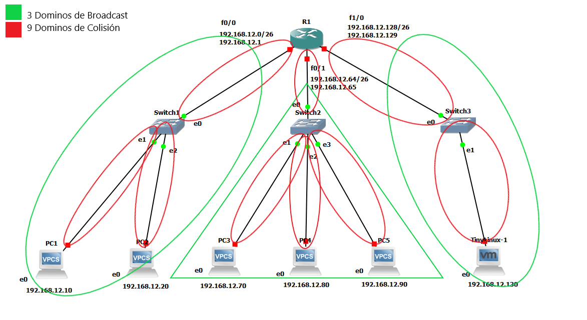
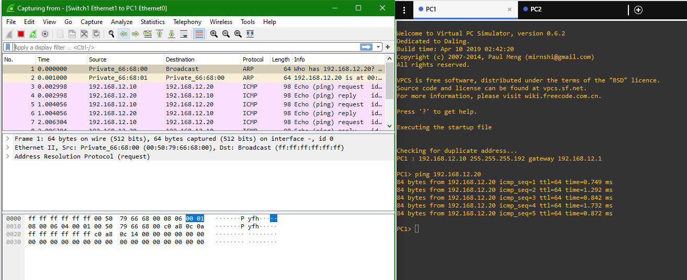
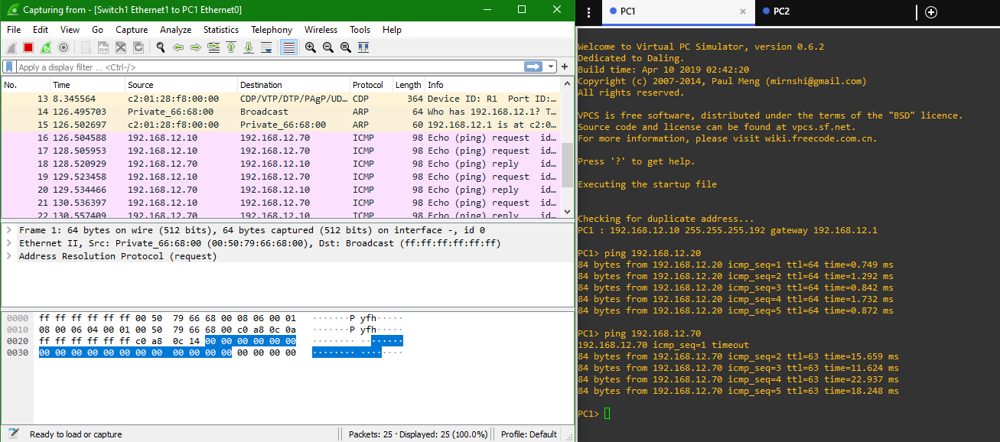
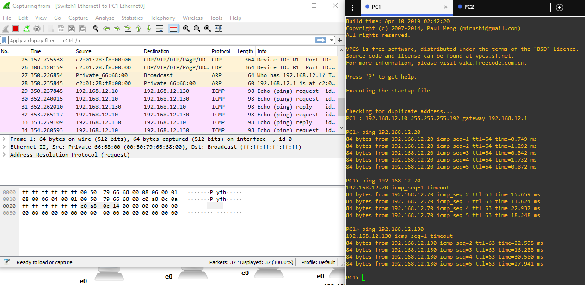
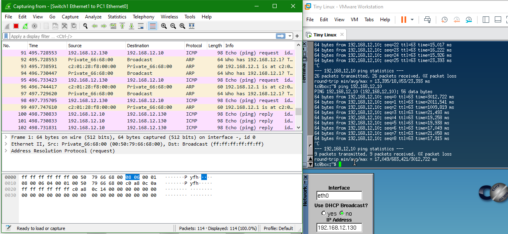

# Manual de Reportes

## Cálculos de dominio de broadcast y dominios de colisión de la topología implementada.

>Imagen 1: Topología de Red con sus cálculos de dominios

Sabiendo que un Switch tiene un dominio de colisión por puerto y tenemos 3 switches, los cuales; el primero tiene una conexión al router y dos a dos VPCS; el segundo tiene una conexión al router y tres a tres VPCS; y el tercero una conexión al router y una a una máquina virtual; todo esto hace una suma de **9 dominios de colisión**. 

Sabiendo que los routers son usados para dividir los dominios de broadcast, cada uno de sus puertos pertenece a un dominio de broadcast y actualmente estamos haciendo uso de 3 de sus puerto, por lo tanto tenemos **3 dominios de broadcast**.

## Capturas de paquetes en cada dispositivo de red utilizado

>Imagen 2: Capturando paquetes de una VPCS comunicándose a otra de su mismo departamento.

>Imagen 3: Capturando paquetes de una VPCS comunicándose a otra de un departamento diferente.

>Imagen 4: Capturando paquetes de una VPCS comunicándose a una máquina virtual de un departamento diferente.

>Imagen 5: Capturando paquetes de una máquina virtual comunicándose a una VPCS de otro departamento.
